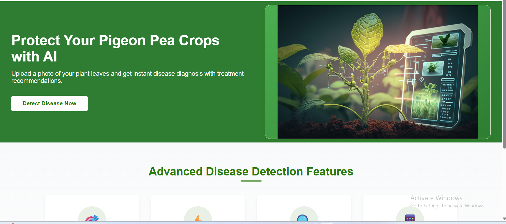

<h1 align="center">🌾 Hybrid-AI-Pegion-Pea-Disease-Prediction</h1>

Hybrid AI model for pegion pea leaf disease classification and prediction using machine learning

  

<h2>📌 Overview</h2>

The <b>Hybrid AI Model for Pigeon Pea Leaf Disease Classification and Prediction</b> is a web-based application that uses machine learning to identify and classify diseases in pigeon pea leaves.

Users can upload leaf images and get instant disease predictions along with useful insights for crop management.

<h2>✨ Key Features</h2>

<ul>
  <li><b>AI-based pigeon pea leaf disease classification</b></li>
  <li><b>Image-based disease prediction using machine learning</b></li>
  <li><b>Hybrid AI model for improved prediction accuracy</b></li>
  <li><b>User-friendly web interface built using Flask</b></li>
  <li><b>Fast and reliable disease prediction results</b></li>
</ul>
<h2>🛠 Technologies Used</h2>

<ul>
  <li><b>Programming Language:</b> Python</li>
  <li><b>Web Framework:</b> Flask</li>
  <li><b>Machine Learning:</b> Support Vector Machine (SVM), PCA</li>
  <li><b>Image Processing:</b> OpenCV</li>
  <li><b>Libraries:</b> NumPy, Pandas, Scikit-learn</li>
  <li><b>Frontend:</b> HTML, CSS</li>
</ul>
<h2>📂 Project Structure</h2>

<pre>
pigeon_pea_crop/
│── app.py
│── train_model.py
│── test_model.py
│── feature_extractor.py
│── create_labels.py
│── create_labelencoder.py
│── requirements.txt
│── svm_model.zip
│
├── static/
│   └── style.css
│
├── templates/
│   ├── index.html
│   ├── disease_detection.html
│   └── result.html
│
├── images/
│   └── homepage.png
│
└── README.md
</pre>
<h2>▶ How to Run the Project</h2>

<ol>
  <li>Clone the repository from GitHub.</li>
  <li>Install the required dependencies:
    <pre>pip install -r requirements.txt</pre>
  </li>
  <li>Extract <b>svm_model.zip</b> to obtain <b>svm_model.pkl</b> and place it in the project root directory.</li>
  <li>Run the application:
    <pre>python app.py</pre>
  </li>
  <li>Open a web browser and visit:
    <pre>http://127.0.0.1:5000/</pre>
  </li>
</ol>
<h2>🧠 Model File</h2>

The trained Support Vector Machine (SVM) model file exceeds GitHub’s file size limit.
Therefore, the model is provided as a compressed ZIP file.

<b>File:</b> svm_model.zip

After downloading, extract the ZIP file to obtain <b>svm_model.pkl</b> and place it in the project root directory before running the application.

<h2>👤 Author</h2>

Developed by <b>Jyoti Kankanawadi</b>

